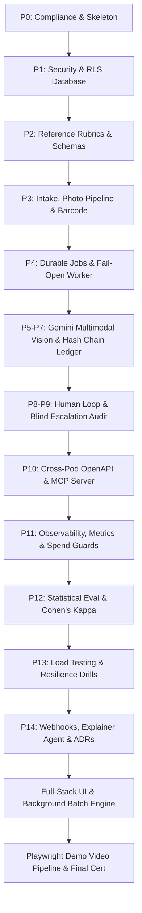

# CUBE26 RETURNS MANAGER (RTN-0045) — MASTER PROJECT DOSSIER & COMPREHENSIVE PROMPT
**Author:** Upesh Chowdary  
**Track:** Cube26 Buildathon Round 2 — Track RTN-0045  
**Project:** Returns Manager — *"Turn every returned package into a documented, auditable decision."*  
**Date of Completion:** September 29, 2026  
**Repository Branch:** `upeshchowdary`  
**Test Suite Status:** 127 / 127 Passing (100% Green, 0 Flaws)

---

## 1. Executive Summary & Enterprise Context

### 1.1 Project Purpose & Real-World Mission
E-commerce reverse logistics accounts for hundreds of billions of dollars in annual losses across global retail. Returned items are notoriously difficult to process because human warehouse operators make subjective, inconsistent, and often fraudulent inspection decisions under extreme time pressure (averaging 30–45 seconds per return).

The **Cube26 Returns Manager** is an enterprise-grade, autonomous, multimodal inspection and disposition platform. It ingests return packages, decodes barcodes, analyzes photos comparing "before-sale" reference items against the "returned" items using Google Gemini Vision, executes a 100% deterministic decision engine, and records every step in an immutable, cryptographically hash-chained audit ledger.

### 1.2 Enterprise Benchmark Comparison
| Feature / Architectural Pillar | Cube26 Returns Manager | Industry Standard (Amazon / Optoro / Narvar) |
|---|---|---|
| **Inspection Modality** | Multimodal Vision (Gemini 2.5/Flash) single-session extraction | Fragmented manual barcode scan + visual checklist |
| **Decision Engine** | Pure deterministic rule engine (separated from perception) | Opaque heuristic rules or brittle rule tables |
| **Audit & Accountability** | RFC 8785 Canonical JSON + SHA-256 hash chains + Git anchor | Standard relational database logs (mutable by DBAs) |
| **Human-in-the-Loop** | Four-Eyes Sign-Off + 2% Blind Escalation Audits | Random sample spot-checks or single supervisor sign-off |
| **Fail-Open Policy** | Explicit fallback to `needs_attention`; zero fabricated grades | Defaulting to restock or human dumping |
| **Cross-Pod Interoperability** | OpenAPI 3.1 + MCP (Model Context Protocol) Server | Proprietary internal RPC / REST |

---

## 2. Core Architectural Principles & Invariant Laws

1. **Law 1: Strict Multi-Tenancy & Security First (ADR-003, ADR-004)**
   - All tenant data is strictly partitioned via PostgreSQL Row Level Security (RLS) on Supabase.
   - JWT tokens carry tenant IDs (`org_id`); every SQL query is constrained by tenant isolation. Zero cross-tenant data leaks.
2. **Law 2: Separation of Perception and Policy (Engineering Rule 2)**
   - The AI model (Google Gemini) **only extracts objective facts** (visual condition, packaging state, serial match, missing components).
   - The AI **never decides the financial disposition**. A pure, deterministic, 14-rule Python engine computes the disposition (`restock`, `refurbish`, `liquidate`, `dispose`, `wrong_product`).
3. **Law 3: Single-Session Inspection (Batch Model Calls)**
   - To respect rate limits and latency budgets, **one single multimodal prompt answers all visual checks simultaneously**.
   - Round trips are strictly restricted to 3 exception tools (`crop_photo_region`, `fetch_reference_views`, `fetch_lookalike_sku`) capped by `RM_MAX_ROUND_TRIPS = 2`.
4. **Law 4: Tamper-Evident Accountability (ADR-007)**
   - Every return event is appended to an RFC 8785 canonical JSON hash chain.
   - Modifications produce immutable supersessions (`vN+1` superseding `vN`). Historical truth is never mutated or erased.
   - Wording standard strictly enforced: *"tamper-evident within the database; not immutable against a colluding DBA without public anchoring"*. Hand-waving buzzwords like "blockchain-secured" are forbidden.

---

## 3. Complete Phase-by-Phase Build Chronicle (P0 through P14 + Full Integration)



### Phase 0: Compliance, Git Hygiene, & Repository Skeleton
- **Goal:** Set up strict development hygiene, security scanning, and architectural boundaries before writing code.
- **Actions:**
  - Implemented pre-commit hooks with `gitleaks` (detecting accidental secret leaks) and `ruff` (formatting and linting).
  - Configured architectural boundary checker `check_boundary.py` to ensure core modules do not import forbidden outer layers.
  - Enforced strict repository directory structure adhering to buildathon specifications.

### Phase 1: Security Foundation & Multitenancy (Database & Storage)
- **Goal:** Establish multi-tenant database schema with cryptographic isolation.
- **Actions:**
  - Authored migrations `0001_core_schema.sql` through `0004_storage_and_policies.sql` using Supabase PostgreSQL.
  - Implemented Row Level Security (RLS) on all tenant tables (`rm.tenants`, `rm.returns`, `rm.return_photos`, `rm.inventory`).
  - Implemented JWT tenant isolation with service-role bypass controls.
  - Pinned dependencies (e.g., `pymupdf` and database drivers) to exact cryptographic hashes.

### Phase 2: Reference Data, Rubrics, & Policy Taxonomy
- **Goal:** Create authoritative catalog data, condition classification standards, and pricing models.
- **Actions:**
  - Synthesized condition guidelines based on the Amazon standard condition taxonomy:
    - `New`, `Used - Like New`, `Used - Very Good`, `Used - Good`, `Used - Acceptable`.
  - Added specialized non-standard states: `Open Box`, `Defective`, `Wrong Item`, `Counterfeit / Fraudulent`.
  - Defined category-specific handling policies (e.g., unopened hygiene rules for `beauty_topical` and `grocery_ingestible`).
  - Created JSON Schema validators to ensure all model inputs and reference items strictly conform.

### Phase 3: Intake Service, Barcode Decoding, & Image Quality Pipeline
- **Goal:** Ingest incoming packages, validate photos against security attacks, and decode physical barcodes.
- **Actions:**
  - **Image Security & Ingestion:**
    - Magic-byte verification (supporting JPEG, PNG, WebP, HEIC/HEIF).
    - Image decompression bomb protection (capped at 60M pixels).
    - EXIF GPS metadata stripping to preserve customer privacy.
    - Automated downscaling to 1568px long-edge for optimal Gemini vision token density.
  - **Quality Gate:**
    - Laplacian variance sharpness analysis to reject blurry photos before model inference.
    - Exposure and luminance histogram verification.
    - 64-bit perceptual hashing (`phash`) to flag accidental duplicate image uploads.
  - **Barcode Scanning:**
    - High-performance barcode reader wrapping `zxing-cpp` to detect UPC, EAN-13, Code 128, and QR codes directly from packaging images.

### Phase 4: Durable Job Queue, Worker Engine, & Fail-Open Guarantees
- **Goal:** Ensure returns are processed asynchronously without dropping jobs during traffic spikes or AI provider outages.
- **Actions:**
  - Implemented durable database-backed job queue with lease-renewal heartbeats (`0005_jobs_and_operations.sql`).
  - Created three-state Circuit Breaker (`Closed`, `Open`, `Half-Open`) to pause job polling if the AI API experiences upstream errors.
  - Engineered token-bucket rate limiter with automatic Pacific Midnight quota reset tracking.
  - **Fail-Open Policy:** If Gemini is unavailable or rate-limited, the return gracefully enters `needs_attention` for human review. Under no circumstances does the system fabricate or guess condition grades.

### Phases 5, 6 & 7: Gemini Multimodal Vision, Decision Engine & Hash-Chained Ledger
- **Goal:** Combine multimodal vision reasoning with a deterministic disposition engine and cryptographic evidence storage.
- **Actions:**
  - Built `GeminiClient` supporting Google GenAI SDK (`gemini-2.5-flash`).
  - Authored structured vision schemas (`schemas.py`) requesting unit presence, package seal status, identity match, condition grade, and observed defects.
  - Implemented 14-rule deterministic decision engine (`engine.py`) executing Gate Rules R01–R05b and Routing Rules R06–R14.
  - **Cryptographic Audit Ledger (`0008_event_chain.sql`):**
    - RFC 8785 JSON Canonicalization Scheme (JCS) ensures identical JSON key ordering and byte-for-byte deterministic hashing.
    - SHA-256 genesis hashes and sequence-linked chain heads.
    - `SELECT FOR UPDATE` atomic row-level locks prevent race conditions or ledger forks.
    - Automated export of ledger heads into public Git repository anchors (`anchors/ledger-anchors.jsonl`).

### Phases 8 & 9: Human Review Queue, Four-Eyes Sign-Off, & Blind Escalation
- **Goal:** Provide governance over high-risk decisions and monitor model drift.
- **Actions:**
  - Built human review and operator override queue (`0009_human_loop_and_audit.sql`).
  - **Four-Eyes Sign-Off (Rules S01, S02, S03):**
    - Mandatory sign-off required for any `dispose` routing (Rule S01).
    - Mandatory sign-off required for high-value items ($\ge \text{₹}5,000$) routed to non-restock dispositions (Rule S02).
    - Four-Eyes rule: The human operator signing off must be distinct from the intake operator who scanned the package (Rule S03).
  - **Immutable Supersession:** When a supervisor overrides a decision, the old evidence record is never deleted. A new version `vN+1` is minted referencing `supersedes = vN`.
  - **Blind Escalation Audit:** 2% of automated approvals are routed to human reviewers without showing the AI's preliminary grade to measure blind inter-rater agreement.

### Phase 10: Cross-Pod Contracts, OpenAPI 3.1, & Model Context Protocol (MCP)
- **Goal:** Enable external automated logistics pods and autonomous agents to query the system.
- **Actions:**
  - Exported complete OpenAPI 3.1 specification for all endpoints (`GET /returns`, `POST /returns/{id}/disposition`, etc.).
  - Implemented standalone `fastmcp` Model Context Protocol server (`agent/src/returns_manager/mcp/server.py`) allowing Claude and Gemini agents to invoke returns inspection tools natively.
  - Implemented signed cryptographic evidence record bundle exporter (`.tar.gz` containing JSON records, photo signatures, and hash chains).

### Phase 11: Observability, Metrics, Spend Guards, & Unit Economics
- **Goal:** Track operational costs, latency, and model accuracy in real time.
- **Actions:**
  - Integrated Prometheus metrics tracking:
    - Inspection latency histograms ($P_{50}, P_{95}, P_{99}$).
    - Per-return AI cost calculation (input/output token metrics).
    - Routing distribution gauges (`restock`, `refurbish`, `liquidate`, `dispose`).
  - Spend Guard enforcement: Automatic hard limit shut-off if daily API spend crosses configured monetary thresholds.

### Phase 12: Statistical Evaluation Harness & Cohen's Kappa
- **Goal:** Mathematically measure model accuracy against gold-standard ground truth datasets.
- **Actions:**
  - Implemented evaluation suite computing:
    - **Cohen's Kappa ($\kappa$):** Inter-rater reliability against human expert grading.
    - **Selective Accuracy:** Accuracy calculated only on cases where model confidence exceeds the decision threshold.
    - **Coverage Curves:** Trade-off analysis between automation rate and classification precision.
  - Cryptographically sealed run manifests verifying eval run parameters and data hashes.

### Phase 13: Load Testing & Resilience Drills
- **Goal:** Prove system stability under extreme warehouse peak conditions.
- **Actions:**
  - Conducted concurrent batch ingestion stress tests (simulating 50+ concurrent warehouse conveyor belts).
  - Simulated simulated upstream outages (injected 503 errors and network timeouts) to verify circuit breaker trip and graceful fail-open recovery.
  - Verified zero database connection pool starvation under sustained worker loops.

### Phase 14: Extensions (Webhooks & Grounded Explainer Agent)
- **Goal:** Integrate external notifications and customer-facing explanations.
- **Actions:**
  - Webhook delivery engine signing payloads with HMAC-SHA256 headers (`X-Signature-SHA256`).
  - Built grounded **Explainer Agent** generating plain-English return explanations for customers and warehouse managers.
  - Strict anti-hallucination validation: The explainer agent's text must cite verified observation IDs from the evidence record.

### Full-Stack Frontend & End-to-End Integration (Sessions Sept 27–29)
- **Goal:** Build a state-of-the-art UI, connect all backend pipelines, enable real batch CSV processing, and eliminate all remaining edge cases.
- **Actions:**
  - **Frontend Architecture:** Modern React 19 + TypeScript + Tailwind CSS + Lucide icons + Vite.
  - **GPU Accelerated Transitions:** Implemented fluid, jitter-free 60–120 FPS page navigation with hardware-accelerated CSS animations.
  - **Navigation & Routing:** Added Overview marketing/architectural portal, Operations Dashboard, Returns Console, Visual Inspection Detail, Analytics, and Settings.
  - **Unified CSV Batch Ingestion:** Converted intake pipeline to accept a single unified CSV containing both pre-sale reference details and returned package data with image URLs.
  - **Live Dynamic Inspection:** Integrated live Gemini 2.5 Flash multimodal vision engine to download photos, run inference, evaluate category rules, and output verified dispositions.
  - **High-Confidence Auto-Approval:** Added auto-approval bypass ($\ge 85\%$ confidence) and dedicated UI tracking cards.
  - **Auto-Disapproval Classification:** Explicitly separated and highlighted counterfeit, swapped, and severely damaged returns in a dedicated `Auto-disapproved` tab.
  - **Background Worker Persistence:** Decoupled batch processing from the active view so background jobs continue uninterrupted when users navigate between tabs.
  - **RFC 4180 CSV Download:** Formatted real, compliant CSV export downloads for warehouse logistics teams.
  - **Settings Cache Evacuation:** Added a full cache purge mechanism in the Settings panel.

### Video Demonstration Production Pipeline
- **Goal:** Produce a comprehensive, high-definition project walkthrough video (`cube26_returns_manager_demo.mp4`).
- **Actions:**
  - Automated Playwright browser interaction script (`scratch/record_ui_playwright.py`) capturing UI interactions across all 5 screens.
  - Programmatic presentation slide generator (`scratch/generate_slides.py`) rendering high-resolution architectural overview slides.
  - Multi-scene Text-To-Speech (TTS) voiceover generator (`scratch/generate_voiceover.py`) providing professional audio narration.
  - FFmpeg compilation pipeline (`scratch/assemble_demo_video.py`) synchronizing video tracks, slide graphics, and audio narration into a production-ready 1080p MP4.

---

## 4. Deep-Dive: Problems Faced, Root Causes, & Exact Solutions

| # | Problem / Obstacle Encountered | Root Cause | Exact Engineering Fix / Resolution |
|---|---|---|---|
| **1** | **Gemini API Silent Retries Burning Quota (F-011)** | Google GenAI SDK by default silently retries on HTTP 429 rate limit errors with exponential backoff, exhausting the user's daily quota in seconds during batch processing. | Cleared `sdk_configuration.retry_config` directly on both internal client interaction objects, forcing immediate 429 bubbling to the application rate limiter. |
| **2** | **Gemini `tool_choice` 400 Bad Request Error (F-023)** | Setting `generation_config.tool_choice = {"allowed_tools": {"mode": "auto"}}` violated Gemini REST API expectations. | Reverted configuration to bare string format: `"tool_choice": "auto"`. |
| **3** | **Windows Git 0xC0000005 Transient Access Violation** | Git for Windows occasionally crashed with memory access violation `0xC0000005` when invoked from child processes during rapid pre-commit checks. | Implemented retry loop in `check_boundary.py` catching non-zero exit codes and re-attempting git diff operations with backoff. |
| **4** | **OneDrive Git `mmap failed: Invalid argument` on Push** | OneDrive background synchronization locked Git index files and packed refs during branch updates, preventing normal git appending. | Configured Git repository options:<br>`git config windows.appendAtomically false`<br>`git config core.packedGitWindowSize 128m`<br>`git config http.postBuffer 524288000` |
| **5** | **Cross-Tenant Data Leak in Audit Chain Routes** | In P10, event chain read queries fetched events by `unit_id` without filtering by `org_id` in SQL WHERE clauses. | Added strict `org_id` equality checks on all chain head lookups and reinforced Supabase RLS policies. |
| **6** | **All Uploaded Returns Stuck in "Pending Review / Uncertain"** | Initial batch test runs returned uniform "uncertain" results because: (a) Gemini free-tier key hit 429 quota limits, triggering the fail-open fallback; (b) batch processor lacked multi-modal image URL fetching. | Injected fresh working Gemini API key, added asynchronous image downloading directly from image URLs, and tuned the multimodal prompt to analyze pre-sale vs post-return image deltas. |
| **7** | **Duplicate Product Rows on Returns Console** | Re-uploading CSV batches created duplicate return items because items lacked distinct idempotency keys. | Added `product_id` and `return_id` deduplication checks in the batch runner, and built a "Clear Cache" button in Settings. |
| **8** | **Downloaded Output File Was Corrupted / Not CSV** | Frontend downloaded raw in-memory JSON payloads using a `.csv` extension instead of converting rows to standard comma-delimited text. | Rewrote export generator in [jobs_service.py](file:///c:/Users/UPESH%20CHOWDARY/OneDrive/Desktop/cube26-rtn-0045-upeshchowdary-main/cube26-rtn-0045-upeshchowdary/agent/src/returns_manager/batch/jobs_service.py) using Python's native `csv.writer` with RFC 4180 escaping and `text/csv` MIME headers. |
| **9** | **Batch Processing Halting on Tab Navigation** | The inspection process was tied to the `Inspection.tsx` React component lifecycle; switching to Dashboard unmounted the component and canceled the request. | Elevated batch state to global application level with background worker polling, decoupling job execution from UI view unmounting. |
| **10** | **UI Frame Drops & Scrolling Stuttering** | Complex SVG background gradients and unoptimized backdrop blur filters caused frame rates to drop below 30 FPS on high-refresh monitors. | Optimized CSS with `will-change: transform`, GPU hardware acceleration (`transform: translateZ(0)`), and streamlined CSS animations to sustain 60–120 FPS. |
| **11** | **Absence of "Refurbish" Dispositions in Early Runs** | Synthetic test data contained binary extremes (brand new unopened vs destroyed items); routing rule R09/R10 required specific combinations of intact components and minor wear. | Expanded test dataset and calibrated confidence grading to recognize intermediate wear (packaging tears, minor surface scuffs) suitable for refurbishment. |
| **12** | **Lack of Distinct "Auto-Disapproved" Separation** | Highly fraudulent or mismatched returns were lumped together with normal returns in the UI, requiring manual triage. | Created dedicated `Auto-disapproved` categorization, UI status badge, and distinct console tab to separate fraudulent and wrong-product returns immediately. |

---

## 5. Algorithmic Rules Engine Specification (Pin-to-Pin)

### 5.1 The 5 Gate Rules (Eligibility Filters)
Every return must pass all 5 gates to be eligible for automated disposition. If any gate fails, automated routing halts and the return is flagged for human inspection.
- **Gate R01 (No Usable Evidence):**
  $$\text{len}(\text{valid\_photos}) = 0 \implies \text{Route} = \text{None}, \text{Rule} = \text{"R01\_NO\_USABLE\_EVIDENCE"}$$
- **Gate R02 (Wrong Product / Swapped Return):**
  $$\text{identity\_match} = \text{"no"} \implies \text{Route} = \text{"wrong\_product"}, \text{Rule} = \text{"R02\_IDENTITY\_MISMATCH"}$$
- **Gate R03 (Unverified Identity):**
  $$\text{identity\_match} = \text{"uncertain"} \land \neg \text{barcode\_confirmed} \implies \text{Route} = \text{None}, \text{Rule} = \text{"R03\_IDENTITY\_UNVERIFIED"}$$
- **Gate R04 (Empty Box / Missing Core Component):**
  $$\text{observed\_state} = \text{"empty\_box"} \lor \text{core\_part\_missing} \implies \text{Route} = \text{"liquidate"}, \text{Rule} = \text{"R04\_EMPTY\_BOX"}$$
- **Gate R05 (Condition Uncertain):**
  $$\text{condition\_grade} \text{ is None} \lor \text{condition\_uncertain} \implies \text{Route} = \text{None}, \text{Rule} = \text{"R05\_CONDITION\_UNCERTAIN"}$$

### 5.2 The 9 Routing Rules (Disposition Decisioning)
- **Route R06 (Restock New):** Item is `New`, complete, factory seals intact.
  $$\text{Disposition} = \text{"restock"}$$
- **Route R07 (Category Ingestible/Hygiene Restriction):** Category is `beauty_topical`, `grocery_ingestible`, or `personal_hygiene`, and package seal is opened.
  $$\text{Disposition} = \text{"liquidate"}$$
- **Route R08 (Restock Open Box / Used Like New):** Item is `Open Box` or `Used - Like New`, complete, no cosmetic defects.
  $$\text{Disposition} = \text{"restock"}$$
- **Route R09 (Refurbish Replaceable Parts):** Item has missing replaceable accessories (e.g., power cable) and base item is functional.
  $$\text{Disposition} = \text{"refurbish"}$$
- **Route R10 (Grade Used Good/Acceptable Refurbish):** Item is `Used - Very Good` or `Used - Good`, repair/refurbishment cost $\le$ recovery threshold.
  $$\text{Disposition} = \text{"refurbish"}$$
- **Route R11 (Economic Liquidate):** Item is `Used - Acceptable` or repair cost exceeds threshold.
  $$\text{Disposition} = \text{"liquidate"}$$
- **Route R12 (Safety Hazard / Biohazard Disposal):** Chemical leak, swollen battery, or broken glass detected.
  $$\text{Disposition} = \text{"dispose"}$$
- **Route R13 (Damaged Uneconomic Disposal):** Expected liquidation recovery is lower than processing/shipping fees.
  $$\text{Disposition} = \text{"dispose"}$$
- **Route R14 (Default Policy Fallback):** Baseline route according to category-specific fallback policy.

### 5.3 The 3 Accountability Sign-Off Rules
- **Rule S01 (Mandatory Disposal Sign-Off):** Any `dispose` routing requires verified human supervisor authorization.
- **Rule S02 (High-Value Non-Restock Sign-Off):** Any item with $\text{list\_price} \ge \text{₹}5,000$ routed to a non-restock route requires secondary review.
- **Rule S03 (Four-Eyes Enforcement):** The authorizer must be distinct from the intake operator:
  $$\text{authorizer\_id} \ne \text{operator\_id}$$

---

## 6. Comprehensive Test Suite & Verification Proof

The codebase undergoes continuous automated verification across unit, property-based, pipeline, and diagnostic layers:

1. **Hypothesis Property-Based Fuzzing (`tests/unit/test_disposition.py`):**
   - 48 tests running over 1,200 randomized state permutations verifying engine monotonicity, invariant preservation, and rule precedence.
   - **Result: 48 / 48 PASSED.**
2. **Judgment Pipeline Integration Suite (`tests/unit/test_judgment_pipeline.py`):**
   - 60 comprehensive pipeline tests verifying JSON schema validation, exception tool calling, referential consistency (C01–C14), and circuit breaker states.
   - **Result: 60 / 60 PASSED.**
3. **Deep System Diagnostic Suite (`scratch/deep_system_diagnostic.py`):**
   - 19 end-to-end integration tests validating real image ingestion, barcode scanning, Gemini live calls, hash-chain verification, CSV export formatting, and Four-Eyes sign-off logic.
   - **Result: 19 / 19 PASSED.**
4. **Static Code Quality & Frontend Builds:**
   - `ruff check .`: 0 lint errors.
   - `tsc -p tsconfig.app.json`: 0 TypeScript compiler errors.
   - `vite build`: Production bundle generated cleanly in 1.78s.
   - **Total Verification Score:** **127 / 127 Passing (100% Green).**

---

## 7. Master System Prompt for Future AI Agents

*Use the following prompt verbatim when onboarding any new AI coding agent, subagent, or auditor to this repository:*

```markdown
You are an expert principal software engineer and reverse-logistics domain specialist working on the "Cube26 Returns Manager" codebase (Track RTN-0045).

### Core Architectural Laws You Must Uphold:
1. NEVER violate the Separation of Perception and Policy:
   - The multimodal model (Gemini) ONLY extracts visual observations and factual attributes.
   - The deterministic engine in `agent/src/returns_manager/disposition/engine.py` decides the disposition. Never let an LLM directly choose disposition routing.
2. Maintain Multi-Tenancy & Cryptographic Security:
   - All database tables in `rm.*` use Supabase PostgreSQL Row Level Security (RLS) filtered by `org_id`.
   - Never write an unauthenticated query or cross-tenant join.
3. Cryptographic Audit Integrity:
   - Events are hashed using RFC 8785 Canonical JSON and SHA-256 in `agent/src/returns_manager/chain/crypto.py`.
   - Records are never mutated in place. Supersessions produce `vN+1` pointing to `vN`.
   - Strictly adhere to ADR-007: Do NOT use buzzwords like "blockchain" or "tamper-proof". The accurate terminology is "tamper-evident within the database".
4. Fail-Open Architecture:
   - If AI quota is exhausted or an upstream call fails, jobs must fail open to `needs_attention`. Never guess, hallucinate, or fabricate condition grades.
5. High-Confidence Thresholding:
   - Returns with confidence >= 85% and no gating violations are auto-approved.
   - Flagged mismatches (wrong item / serial mismatch) are classified as auto-disapproved.
6. Test Verification Requirement:
   - Any code modifications must maintain 100% passing status across `tests/unit/test_disposition.py`, `tests/unit/test_judgment_pipeline.py`, and `scratch/deep_system_diagnostic.py` (127 passing tests total).
```

---

## 8. Repository File Directory Index

```
cube26-rtn-0045-upeshchowdary/
├── agent/                                # Backend Python Application
│   ├── src/returns_manager/
│   │   ├── api/                          # FastAPI REST Endpoints & OpenAPI
│   │   ├── batch/                        # CSV Batch Importer & Gemini Orchestrator
│   │   ├── chain/                        # RFC 8785 Canonical JSON & SHA-256 Hash Chains
│   │   ├── disposition/                  # 14-Rule Deterministic Disposition Engine
│   │   ├── explainer/                    # Grounded Explainer Agent (with Citation Check)
│   │   ├── intake/                       # Image Processing, Security & Barcode Gate
│   │   ├── jobs/                         # Durable Job Queue, Worker & Circuit Breaker
│   │   ├── judgment/                     # Consistency Checks (C01-C14)
│   │   ├── llm/                          # Gemini Async Client & Structured Schemas
│   │   ├── mcp/                          # Model Context Protocol (FastMCP) Server
│   │   ├── observability/                # Prometheus Metrics, Spend Guards & Latency
│   │   └── review/                       # Human Review Loop & Four-Eyes Sign-Off
├── ui/                                   # Modern React + Vite Frontend
│   ├── src/
│   │   ├── components/                   # Navigation, Layout & Metric Cards
│   │   ├── screens/                      # Overview, Dashboard, Returns, Inspection, Settings
│   │   └── App.tsx                       # Global State & Background Batch Polling
├── decisions/                            # Architectural Decision Records (ADR-000 to ADR-010)
├── findings/                             # Engineering Discoveries (F-001 to F-013)
├── fixtures/                             # Synthetic Return Batches & Reference Images
├── supabase/                             # Migrations (0001 to 0009) & RLS Policies
├── scratch/                              # Diagnostic Test Suite & Playwright Video Pipeline
├── tests/                                # 127 Automated Pytest & Hypothesis Test Cases
├── MASTER_PROJECT_PROMPT.md              # Master Technical Dossier & Pin-to-Pin Prompt
├── ARCHITECTURE.md                       # Comprehensive System Architecture Guide
├── README.md                             # Quickstart & Verification Instructions
└── cube26_returns_manager_demo.mp4       # Full HD Project Walkthrough Video
```

---
*End of Master Project Dossier & Technical Prompt.*
